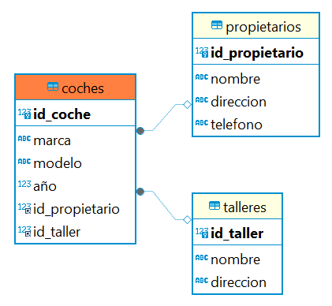
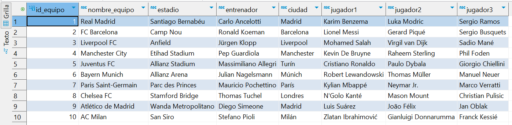
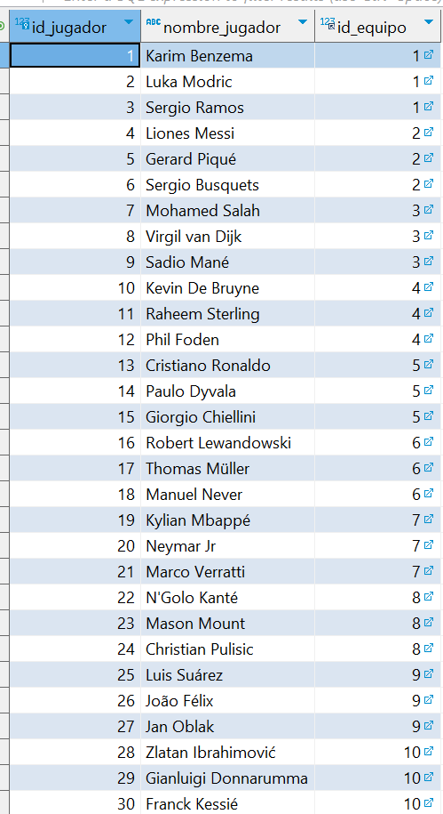
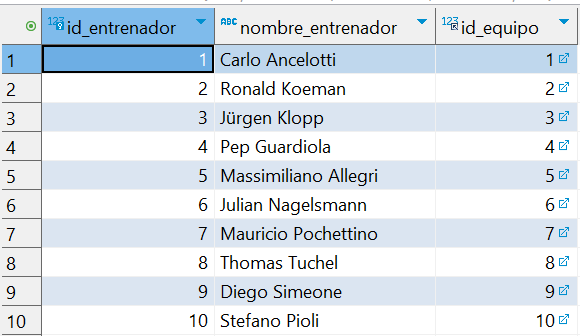
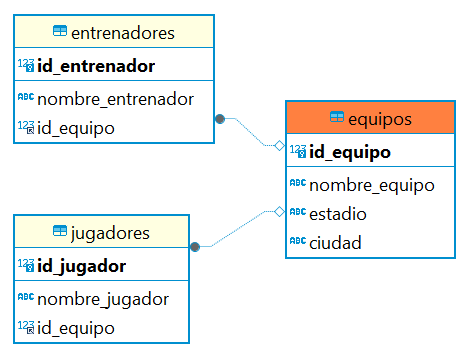
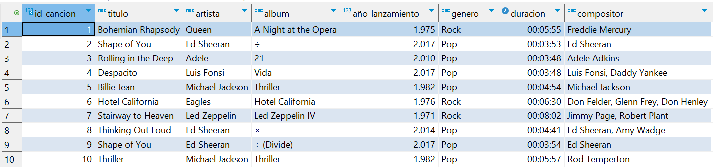

# Data-base---labs

## Ejercicio 1: Normalización de una Base de Datos de Películas

### Descripción: La tabla Peliculas contiene información sobre películas, incluyendo detalles de actores, director, año de estreno, género y país de origen. Esta tabla no está normalizada.

### Instrucciones:
### 1. Identifica las posibles redundancias y dependencias.
### 2. Descompón la tabla Peliculas en varias tablas siguiendo las reglas de normalización hasta alcanzar la 3FN.

1. redundancias:

 - Columna de directores, James Cameron de repite.
 - Columna años, tambien hay años repetidos.
 - Columna genero
 - Columna Actor principal

Dependencias:

Encontre en internet que existen 3 tipos de depndencias (Funcional, parcial y transitiva).

### Dependencias funcionales:
 - id_pelicula --> Titulo
 - id_pelicula --> Director
 - id_pelicula --> año_estreno
 - id_pelicula --> genero
 - id_pelicula --> actor principal
 - id_pelicula --> actor secundario
 - id_pelicula --> pais de origen

 no tenemos informacion para identificar otras dependencias.      
 
2. Descompón la tabla Peliculas en varias tablas siguiendo las reglas de normalización hasta alcanzar la 3FN.

Descomponemos la tabla peliculas asi:

 - Cramos una tabla directores  e insertamos los datos de lso directores 
 - Creamos una tabla de generos e insertamos los valores de generos
 - creamos una tabla de actores e insertamos los valores de actores principales
 - como hacemos todo en un mismo codigo ahora debemos ejecutar un omando que elimine la tabla que existe llamda peliculas el comando es: 
    DROP TABLE IF EXISTS peliculas;
 - Creamos la tabla Peliculas normalizada (es decir con sus claves foraneas correspondientes).

 el codigo de la normalizacion de la tabla de peliculas seria el siguiente:

 CREATE DATABASE IF NOT EXISTS lab1;
	
	use lab1;
	
	DROP DATABASE IF EXISTS lab1;
	
	CREATE DATABASE lab1;
	
	USE lab1;
	
	-- Ejercicio 1: Base de Datos de Películas
	CREATE TABLE Peliculas (
	    id_pelicula INT PRIMARY KEY,
	    titulo VARCHAR(255),
	    director VARCHAR(255),
	    año_estreno INT,
	    genero VARCHAR(255),
	    actor_principal VARCHAR(255),
	    actor_secundario VARCHAR(255),
	    pais_origen VARCHAR(255)
	);	
	
	INSERT INTO Peliculas (id_pelicula, titulo, director, año_estreno, genero, actor_principal, actor_secundario, pais_origen) VALUES
	(1, 'The Shawshank Redemption', 'Frank Darabont', 1994, 'Drama', 'Tim Robbins', 'Morgan Freeman', 'USA'),
	(2, 'The Godfather', 'Francis Ford Coppola', 1972, 'Crime', 'Marlon Brando', 'Al Pacino', 'USA'),
	(3, 'The Dark Knight', 'Christopher Nolan', 2008, 'Action', 'Christian Bale', 'Heath Ledger', 'USA'),
	(4, 'Forrest Gump', 'Robert Zemeckis', 1994, 'Drama', 'Tom Hanks', 'Robin Wright', 'USA'),
	(5, 'Pulp Fiction', 'Quentin Tarantino', 1994, 'Crime', 'John Travolta', 'Samuel L. Jackson', 'USA'),
	(6, 'Inception', 'Christopher Nolan', 2010, 'Sci-Fi', 'Leonardo DiCaprio', 'Joseph Gordon-Levitt', 'USA'),
	(7, 'Titanic', 'James Cameron', 1997, 'Romance', 'Leonardo DiCaprio', 'Kate Winslet', 'USA'),
	(8, 'The Matrix', 'The Wachowskis', 1999, 'Sci-Fi', 'Keanu Reeves', 'Laurence Fishburne', 'USA'),
	(9, 'Avatar', 'James Cameron', 2009, 'Sci-Fi', 'Sam Worthington', 'Zoe Saldana', 'USA'),
	(10, 'Gladiator', 'Ridley Scott', 2000, 'Action', 'Russell Crowe', 'Joaquin Phoenix', 'USA');
	
	-- Normalizacion tabla peliculas

	-- Creamos tabla directores
	CREATE TABLE Directores (
    id_director INT AUTO_INCREMENT PRIMARY KEY,
    nombre VARCHAR(255) NOT NULL,
    pais_origen VARCHAR(255) -- Si un director está asociado con un solo país
	);

	-- Insertamos datos en la tabla Directores
	INSERT INTO Directores (nombre, pais_origen) VALUES
	('Frank Darabont', 'USA'),
	('Francis Ford Coppola', 'USA'),
	('Christopher Nolan', 'USA'),
	('Robert Zemeckis', 'USA'),
	('Quentin Tarantino', 'USA'),
	('James Cameron', 'USA'),
	('The Wachowskis', 'USA'),
	('Ridley Scott', 'USA');

	-- Creamos tabla generos
	CREATE TABLE Generos (
    id_genero INT AUTO_INCREMENT PRIMARY KEY,
    nombre VARCHAR(100) NOT NULL
	);

	-- Insertamos datos en la tabla Generos
	INSERT INTO Generos (nombre) VALUES
	('Drama'),
	('Crime'),
	('Action'),
	('Sci-Fi'),
	('Romance');

	-- Creamos tabla Actores
	CREATE TABLE Actores (
    id_actor INT AUTO_INCREMENT PRIMARY KEY,
    nombre VARCHAR(255) NOT NULL
	);

	-- Insertar datos en la tabla Actores
	INSERT INTO Actores (nombre) VALUES
	('Tim Robbins'),
	('Morgan Freeman'),
	('Marlon Brando'),
	('Al Pacino'),
	('Christian Bale'),
	('Heath Ledger'),
	('Tom Hanks'),
	('Robin Wright'),
	('John Travolta'),
	('Samuel L. Jackson'),
	('Leonardo DiCaprio'),
	('Joseph Gordon-Levitt'),
	('Kate Winslet'),
	('Keanu Reeves'),
	('Laurence Fishburne'),
	('Sam Worthington'),
	('Zoe Saldana'),
	('Russell Crowe'),
	('Joaquin Phoenix');

	DROP TABLE IF EXISTS peliculas;

	CREATE TABLE Peliculas (
    id_pelicula INT AUTO_INCREMENT PRIMARY KEY,
    titulo VARCHAR(255) NOT NULL,
    id_director INT,
    año_estreno INT,
    id_genero INT,
    id_actor_principal INT,
    id_actor_secundario INT,
    FOREIGN KEY (id_director) REFERENCES Directores(id_director),
    FOREIGN KEY (id_genero) REFERENCES Generos(id_genero),
    FOREIGN KEY (id_actor_principal) REFERENCES Actores(id_actor),
    FOREIGN KEY (id_actor_secundario) REFERENCES Actores(id_actor)
	);

## Ejercicio 2: Normalización de una Base de Datos de Coches
### Descripción: 
### La tabla Coches contiene información sobre coches, incluyendo detalles del propietario y el taller de servicio. Esta tabla no está normalizada.

### Instrucciones:
Identifica las posibles redundancias y dependencias.
Descompón la tabla Coches en varias tablas siguiendo las reglas de normalización hasta alcanzar la 3FN.

### Dependencias funcionales:

- id_coche -> marca
- id_coche -> modelo
- id_coche -> año
- id_coche -> propietario_nombre
- id_coche -> propietario_direccion
- id_coche -> propietario_telefono
- id_coche -> taller_nombre
- id_coche -> taller_direccion

### Dependencias Transitivas

Podemos observar que:

- propietario_direccion y propietario_telefono dependen de propietario_nombre. Similarmente, taller_direccion depende de taller_nombre.

## Normalización a 3FN
Para normalizar la tabla Coches hasta la Tercera Forma Normal (3FN), seguiremos estos pasos:

1. 1FN (Primera Forma Normal): Esta en valores atomicos desde la creacion de la tabla.
2. 2FN (Segunda Forma Normal): Eliminar dependencias parciales.

### Paso 1: Crear Tablas para separar la informacion:

- Tabla Propietarios
- Tabla Talleres
- Tabla Coches (Con claves foraneas correspondientes)

CREATE DATABASE IF NOT EXISTS lab1;
	
	use lab1;
	
	DROP DATABASE IF EXISTS lab1;
	
	CREATE DATABASE lab1;
	
	USE lab1;
	
	-- Ejercicio 2: Base de Datos de Coches
	CREATE TABLE Coches (
	    id_coche INT PRIMARY KEY,
	    marca VARCHAR(255),
	    modelo VARCHAR(255),
	    año INT,
	    propietario_nombre VARCHAR(255),
	    propietario_direccion VARCHAR(255),
	    propietario_telefono VARCHAR(255),
	    taller_nombre VARCHAR(255),
	    taller_direccion VARCHAR(255)
	);
	
	-- Insertar datos en la tabla Coches
	INSERT INTO Coches (id_coche, marca, modelo, año, propietario_nombre, propietario_direccion, propietario_telefono, taller_nombre, taller_direccion) VALUES
	(1, 'Toyota', 'Corolla', 2018, 'Juan Pérez', 'Calle Principal 123', '123-456-7890', 'Taller Juan', 'Avenida Central 456'),
	(2, 'Honda', 'Civic', 2017, 'María López', 'Avenida Libertad 456', '987-654-3210', 'Taller Martínez', 'Calle Independencia 789'),
	(3, 'Ford', 'Mustang', 2020, 'Pedro García', 'Calle Sur 789', '456-789-0123', 'Taller Rodríguez', 'Avenida Norte 123'),
	(4, 'Chevrolet', 'Camaro', 2019, 'Ana Martínez', 'Calle Este 567', '321-654-0987', 'Taller Sánchez', 'Avenida Oeste 567'),
	(5, 'Nissan', 'Altima', 2016, 'Luisa Torres', 'Avenida Central 789', '789-012-3456', 'Taller Gómez', 'Calle Principal 234'),
	(6, 'BMW', 'X5', 2021, 'Carlos Ruiz', 'Calle Norte 345', '210-987-6543', 'Taller López', 'Avenida Sur 890'),
	(7, 'Mercedes-Benz', 'C-Class', 2019, 'Sofía Rodríguez', 'Avenida Oeste 890', '543-210-9876', 'Taller Martín', 'Calle Este 678'),
	(8, 'Audi', 'A4', 2018, 'Javier Gómez', 'Calle Este 789', '012-345-6789', 'Taller Pérez', 'Avenida Norte 345'),
	(9, 'Hyundai', 'Elantra', 2017, 'Laura Sánchez', 'Avenida Libertad 678', '876-543-2109', 'Taller Hernández', 'Calle Sur 456'),
	(10, 'Kia', 'Optima', 2019, 'Diego Martín', 'Calle Principal 567', '234-567-8901', 'Taller Ruiz', 'Avenida Central 678');
	
	-- Normalizacion Coches

	-- Separamos la informacion de propietarios
	CREATE TABLE Propietarios (
    id_propietario INT AUTO_INCREMENT PRIMARY KEY,
    nombre VARCHAR(255) NOT NULL,
    direccion VARCHAR(255),
    telefono VARCHAR(255)
	);
	
	-- Insertar datos en la tabla Propietarios
	INSERT INTO Propietarios (nombre, direccion, telefono) VALUES
	('Juan Pérez', 'Calle Principal 123', '123-456-7890'),
	('María López', 'Avenida Libertad 456', '987-654-3210'),
	('Pedro García', 'Calle Sur 789', '456-789-0123'),
	('Ana Martínez', 'Calle Este 567', '321-654-0987'),
	('Luisa Torres', 'Avenida Central 789', '789-012-3456'),
	('Carlos Ruiz', 'Calle Norte 345', '210-987-6543'),
	('Sofía Rodríguez', 'Avenida Oeste 890', '543-210-9876'),
	('Javier Gómez', 'Calle Este 789', '012-345-6789'),
	('Laura Sánchez', 'Avenida Libertad 678', '876-543-2109'),
	('Diego Martín', 'Calle Principal 567', '234-567-8901');
	
	CREATE TABLE Talleres (
    id_taller INT AUTO_INCREMENT PRIMARY KEY,
    nombre VARCHAR(255) NOT NULL,
    direccion VARCHAR(255)
	);

	-- Insertar datos en la tabla Talleres
	INSERT INTO Talleres (nombre, direccion) VALUES
	('Taller Juan', 'Avenida Central 456'),
	('Taller Martínez', 'Calle Independencia 789'),
	('Taller Rodríguez', 'Avenida Norte 123'),
	('Taller Sánchez', 'Avenida Oeste 567'),
	('Taller Gómez', 'Calle Principal 234'),
	('Taller López', 'Avenida Sur 890'),
	('Taller Martín', 'Calle Este 678'),
	('Taller Pérez', 'Avenida Norte 345'),
	('Taller Hernández', 'Calle Sur 456'),
	('Taller Ruiz', 'Avenida Central 678');

	DROP TABLE IF EXISTS Coches;

	CREATE TABLE Coches (
    id_coche INT AUTO_INCREMENT PRIMARY KEY,
    marca VARCHAR(255),
    modelo VARCHAR(255),
    año INT,
    id_propietario INT,
    id_taller INT,
    FOREIGN KEY (id_propietario) REFERENCES Propietarios(id_propietario),
    FOREIGN KEY (id_taller) REFERENCES Talleres(id_taller)
	);	

	-- Insertar datos en la tabla Coches
	INSERT INTO Coches (marca, modelo, año, id_propietario, id_taller) VALUES
	('Toyota', 'Corolla', 2018, 1, 1),
	('Honda', 'Civic', 2017, 2, 2),
	('Ford', 'Mustang', 2020, 3, 3),
	('Chevrolet', 'Camaro', 2019, 4, 4),
	('Nissan', 'Altima', 2016, 5, 5),
	('BMW', 'X5', 2021, 6, 6),
	('Mercedes-Benz', 'C-Class', 2019, 7, 7),
	('Audi', 'A4', 2018, 8, 8),
	('Hyundai', 'Elantra', 2017, 9, 9),
	('Kia', 'Optima', 2019, 10, 10);

3FN (Tercera Forma Normal): Eliminar dependencias transitivas.

### Resultado

La tabla Coches original ha sido descompuesta en tres tablas normalizadas (Coches, Propietarios, Talleres) siguiendo las reglas de normalización hasta alcanzar la 3FN. Esto elimina redundancias y mejora la integridad de los datos, haciendo que la base de datos sea más eficiente y fácil de mantener

## Ejercicio 3: Normalización de una Base de Datos de Equipos de Fútbol
### Descripción: La tabla EquiposFutbol contiene información sobre equipos de fútbol, incluyendo detalles del estadio, entrenador y jugadores. Esta tabla no está normalizada.

### Instrucciones:

1. Identifica las posibles redundancias y dependencias.
2. Descompón la tabla EquiposFutbol en varias tablas siguiendo las reglas de normalización hasta alcanzar la 3FN.

### Solución:

1. Identifica las posibles redundancias y dependencias.

### Dependencias funcionales:

id_equipo determina nombre_equipo, estadio, entrenador, ciudad, jugador1, jugador2, jugador3.
Posibles redundancias:

Si un jugador juega para varios equipos, su nombre y otros detalles se repetirán. (si juega para club y su pais)
Detalles del estadio, entrenador y ciudad se repiten si se cambian con el tiempo o si los equipos tienen múltiples entrenadores.

2. Descompón la tabla EquiposFutbol en varias tablas siguiendo las reglas de normalización hasta alcanzar la 3FN.

### Paso 1: Primera Forma Normal (1FN)

Asegurar que cada columna contiene valores atómicos.
En este caso, nuestra tabla ya está en 1FN porque cada campo contiene un valor único.

Paso 2: Segunda Forma Normal (2FN)

- Eliminar grupos de valores repetidos y crear nuevas tablas para ellos.
- Asegurar que todos los atributos no clave dependen de la clave primaria.

Podemos descomponer la tabla en las siguientes sub-tablas:

- Tabla de equipos

- Tabla de jugadores

- Tabla de entrenadores

Para crear las tablas debemos introducir el siguiente codigo:

CREATE DATABASE IF NOT EXISTS lab1;
	
	use lab1;
	
	DROP DATABASE IF EXISTS lab1;
	
	CREATE DATABASE lab1;
	
	USE lab1;
	
	-- Ejercicio 3: Base de Datos de Equipos de Fútbol
	CREATE TABLE EquiposFutbol (
	    id_equipo INT PRIMARY KEY,
	    nombre_equipo VARCHAR(255),
	    estadio VARCHAR(255),
	    entrenador VARCHAR(255),
	    ciudad VARCHAR(255),
	    jugador1 VARCHAR(255),
	    jugador2 VARCHAR(255),
	    jugador3 VARCHAR(255)
	);
	
	-- Insertar datos en la tabla EquiposFutbol
	INSERT INTO EquiposFutbol (id_equipo, nombre_equipo, estadio, entrenador, ciudad, jugador1, jugador2, jugador3) VALUES
	(1, 'Real Madrid', 'Santiago Bernabéu', 'Carlo Ancelotti', 'Madrid', 'Karim Benzema', 'Luka Modric', 'Sergio Ramos'),
	(2, 'FC Barcelona', 'Camp Nou', 'Ronald Koeman', 'Barcelona', 'Lionel Messi', 'Gerard Piqué', 'Sergio Busquets'),
	(3, 'Liverpool FC', 'Anfield', 'Jürgen Klopp', 'Liverpool', 'Mohamed Salah', 'Virgil van Dijk', 'Sadio Mané'),
	(4, 'Manchester City', 'Etihad Stadium', 'Pep Guardiola', 'Manchester', 'Kevin De Bruyne', 'Raheem Sterling', 'Phil Foden'),
	(5, 'Juventus FC', 'Allianz Stadium', 'Massimiliano Allegri', 'Turín', 'Cristiano Ronaldo', 'Paulo Dybala', 'Giorgio Chiellini'),
	(6, 'Bayern Munich', 'Allianz Arena', 'Julian Nagelsmann', 'Múnich', 'Robert Lewandowski', 'Thomas Müller', 'Manuel Neuer'),
	(7, 'Paris Saint-Germain', 'Parc des Princes', 'Mauricio Pochettino', 'París', 'Kylian Mbappé', 'Neymar Jr.', 'Marco Verratti'),
	(8, 'Chelsea FC', 'Stamford Bridge', 'Thomas Tuchel', 'Londres', "N'Golo Kanté", 'Mason Mount', 'Christian Pulisic'),
	(9, 'Atlético de Madrid', 'Wanda Metropolitano', 'Diego Simeone', 'Madrid', 'Luis Suárez', 'João Félix', 'Jan Oblak'),
	(10, 'AC Milan', 'San Siro', 'Stefano Pioli', 'Milán', 'Zlatan Ibrahimović', 'Gianluigi Donnarumma', 'Franck Kessié');
	
	-- Normalizacion equipos de futbol
	CREATE TABLE Equipos (
    id_equipo INT PRIMARY KEY,
    nombre_equipo VARCHAR(255),
    estadio VARCHAR(255),
    ciudad VARCHAR(255)
	);

	INSERT INTO Equipos (id_equipo, nombre_equipo, estadio, ciudad) VALUES
	(1, 'Real Madrid', 'Santiago Bernabéu', 'Madrid'),
	(2, 'FC Barcelona', 'Camp Nou', 'Barcelona'),
	(3, 'Liverpool FC', 'Anfield', 'Liverpool'),
	(4, 'Manchester City', 'Etihad Stadium', 'Manchester'),
	(5, 'Juventus FC', 'Allianz Stadium', 'Turín'),
	(6, 'Bayern Munich', 'Allianz Arena', 'Múnich'),
	(7, 'Paris Saint-Germain', 'Parc des Princes', 'París'),
	(8, 'Chelsea FC', 'Stamford Bridge', 'Londres'),
	(9, 'Atlético de Madrid', 'Wanda Metropolitano', 'Madrid'),
	(10, 'AC Milan', 'San Siro', 'Milán');

	CREATE TABLE Entrenadores (
    id_entrenador INT PRIMARY KEY AUTO_INCREMENT,
    nombre_entrenador VARCHAR(255),
    id_equipo INT,
    FOREIGN KEY (id_equipo) REFERENCES Equipos(id_equipo)
	);

	INSERT INTO Entrenadores (nombre_entrenador, id_equipo) VALUES
	('Carlo Ancelotti', 1),
	('Ronald Koeman', 2),
	('Jürgen Klopp', 3),
	('Pep Guardiola', 4),
	('Massimiliano Allegri', 5),
	('Julian Nagelsmann', 6),
	('Mauricio Pochettino', 7),
	('Thomas Tuchel', 8),
	('Diego Simeone', 9),
	('Stefano Pioli', 10);

	create table jugadores (
	id_jugador INT primary key auto_increment,
	nombre_jugador VARCHAR(255),
	id_equipo INT,
	foreign key (id_equipo) references equipos(id_equipo)
	);

	insert into jugadores (nombre_jugador, id_equipo) values
	('Karim Benzema', 1),
	('Luka Modric', 1),
	('Sergio Ramos', 1),
	('Liones Messi', 2),
	('Gerard Piqué', 2),
	('Sergio Busquets', 2),
	('Mohamed Salah', 3),
	('Virgil van Dijk', 3),
	('Sadio Mané', 3),
	('Kevin De Bruyne', 4),
	('Raheem Sterling', 4),
	('Phil Foden', 4),
	('Cristiano Ronaldo', 5),
	('Paulo Dyvala', 5),
	('Giorgio Chiellini', 5),
	('Robert Lewandowski', 6),
	('Thomas Müller', 6),
	('Manuel Never', 6),
	('Kylian Mbappé', 7),
	('Neymar Jr', 7),
	('Marco Verratti', 7),
	("N'Golo Kanté", 8),
	('Mason Mount', 8),
	('Christian Pulisic', 8),
	('Luis Suárez', 9),
	('João Félix', 9),
	('Jan Oblak', 9),
	('Zlatan Ibrahimović', 10),
	('Gianluigi Donnarumma', 10),
	('Franck Kessié', 10);

### Resultado

La normalización ayuda a eliminar redundancias y dependencias innecesarias, haciendo la base de datos más eficiente y fácil de mantener. Con las tablas ahora en 3FN, se minimizan las redundancias y se asegura que cada dato se almacene en un único lugar, reduciendo el riesgo de inconsistencias.

## Ejercicio 4: Normalización de una Base de Datos de Canciones

### Descripción: 

La tabla Canciones contiene información sobre canciones, incluyendo detalles del artista, álbum, año de lanzamiento, género, duración y compositor. Esta tabla no está normalizada.

## Instrucciones:

1. Identifica las posibles redundancias y dependencias.
2. Descompón la tabla Canciones en varias tablas siguiendo las reglas de normalización hasta alcanzar la 3FN.

## Solución:

## 1. Identifica las posibles redundancias y dependencias.

## Dependencias funcionales:

- id_cancion determina titulo, artista, album, año_lanzamiento, genero, duracion, compositor.

- artista puede determinar album y año_lanzamiento (si un artista lanza un solo álbum por año, aunque esto no siempre es el caso).

## Posibles redundancias:

- El nombre del artista y el compositor pueden repetirse en varias canciones.

- Los detalles del álbum se repiten para cada canción del mismo álbum.

## 2. Descompón la tabla Canciones en varias tablas siguiendo las reglas de normalización hasta alcanzar la 3FN.

## Descomponer la Tabla

## Paso 1: Primera Forma Normal (1FN)

- Asegurar que cada columna contiene valores atómicos.

En este caso, nuestra tabla ya está en 1FN porque cada campo contiene un valor único.

## Paso 2: Segunda Forma Normal (2FN)

- Eliminar grupos de valores repetidos y crear nuevas tablas para ellos.

- Asegurar que todos los atributos no clave dependen de la clave primaria.

## Podemos descomponer la tabla en las siguientes sub-tablas:

- Canciones (modificamos Tabla que nos dan inicialmente)

- Tabla Artistas.

- Tabla Albums

- Tabla compositores

## Paso 3: Tercera Forma Normal (3FN)

Asegurar que no existen dependencias transitivas (los atributos no clave no deben depender de otros atributos no clave).
En este caso, las tablas ya no tienen dependencias transitivas.

## Resultado

La normalización de la tabla Canciones en varias tablas hasta alcanzar la 3FN elimina redundancias y dependencias innecesarias, haciendo la base de datos más eficiente y fácil de mantener. Con las tablas ahora en 3FN, se minimizan las redundancias y se asegura que cada dato se almacene en un único lugar, reduciendo el riesgo de inconsistencias.

## Codigo para creacion de tablas y adicion de datos:

CREATE DATABASE IF NOT EXISTS lab1;
	
	use lab1;
	
	DROP DATABASE IF EXISTS lab1;
	
	CREATE DATABASE lab1;
	
	USE lab1;
	
	-- Ejercicio 4: Base de Datos de Canciones
	CREATE TABLE Canciones (
	    id_cancion INT PRIMARY KEY,
	    titulo VARCHAR(255),
	    artista VARCHAR(255),
	    album VARCHAR(255),
	    año_lanzamiento INT,
	    genero VARCHAR(255),
	    duracion TIME,
	    compositor VARCHAR(255)
	);
	
	-- Insertar datos en la tabla Canciones
	INSERT INTO Canciones (id_cancion, titulo, artista, album, año_lanzamiento, genero, duracion, compositor) VALUES
	(1, 'Bohemian Rhapsody', 'Queen', 'A Night at the Opera', 1975, 'Rock', '00:05:55', 'Freddie Mercury'),
	(2, 'Shape of You', 'Ed Sheeran', '÷', 2017, 'Pop', '00:03:53', 'Ed Sheeran'),
	(3, 'Rolling in the Deep', 'Adele', '21', 2010, 'Pop', '00:03:48', 'Adele Adkins'),
	(4, 'Despacito', 'Luis Fonsi', 'Vida', 2017, 'Pop', '00:03:48', 'Luis Fonsi, Daddy Yankee'),
	(5, 'Billie Jean', 'Michael Jackson', 'Thriller', 1982, 'Pop', '00:04:54', 'Michael Jackson'),
	(6, 'Hotel California', 'Eagles', 'Hotel California', 1976, 'Rock', '00:06:30', 'Don Felder, Glenn Frey, Don Henley'),
	(7, 'Stairway to Heaven', 'Led Zeppelin', 'Led Zeppelin IV', 1971, 'Rock', '00:08:02', 'Jimmy Page, Robert Plant'),
	(8, 'Thinking Out Loud', 'Ed Sheeran', '×', 2014, 'Pop', '00:04:41', 'Ed Sheeran, Amy Wadge'),
	(9, 'Shape of You', 'Ed Sheeran', '÷ (Divide)', 2017, 'Pop', '00:03:54', 'Ed Sheeran'),
	(10, 'Thriller', 'Michael Jackson', 'Thriller', 1982, 'Pop', '00:05:57', 'Rod Temperton');

	-- Normalizacion tabla de canciones
	-- Creamos 4 tablas eliminando grupos de valores repetidos
	-- Aseguramos que todos los atributos no clave dependan de la clave primaria.
	
	DROP TABLE IF EXISTS Canciones;

	-- Tablas normalizadas

	-- Tabla de Artistas
	CREATE TABLE Artistas (
    id_artista INT PRIMARY KEY AUTO_INCREMENT,
    nombre_artista VARCHAR(255)
	);

	-- Tabla de Albums
	CREATE TABLE Albums (
    id_album INT PRIMARY KEY AUTO_INCREMENT,
    nombre_album VARCHAR(255),
    id_artista INT,
    año_lanzamiento INT,
    FOREIGN KEY (id_artista) REFERENCES Artistas(id_artista)
	);

	-- Tabla de Compositores
	CREATE TABLE Compositores (
    id_compositor INT PRIMARY KEY AUTO_INCREMENT,
    nombre_compositor VARCHAR(255)
	);

	-- Tabla de Canciones
	CREATE TABLE Canciones (
    id_cancion INT PRIMARY KEY,
    titulo VARCHAR(255),
    id_artista INT,
    id_album INT,
    genero VARCHAR(255),
    duracion TIME,
    id_compositor INT,
    FOREIGN KEY (id_artista) REFERENCES Artistas(id_artista),
    FOREIGN KEY (id_album) REFERENCES Albums(id_album),
    FOREIGN KEY (id_compositor) REFERENCES Compositores(id_compositor)
	);

	INSERT INTO Artistas (nombre_artista) VALUES
	('Queen'),
	('Ed Sheeran'),
	('Adele'),
	('Luis Fonsi'),
	('Michael Jackson'),
	('Eagles'),
	('Led Zeppelin');

	INSERT INTO Compositores (nombre_compositor) VALUES
	('Freddie Mercury'),
	('Ed Sheeran'),
	('Adele Adkins'),
	('Luis Fonsi'),
	('Michael Jackson'),
	('Don Felder'),
	('Glenn Frey'),
	('Don Henley'),
	('Jimmy Page'),
	('Robert Plant');

	INSERT INTO Albums (nombre_album, id_artista, año_lanzamiento) VALUES
	('A Night at the Opera', 1, 1975),
	('÷', 2, 2017),
	('21', 3, 2010),
	('Vida', 4, 2017),
	('Thriller', 5, 1982),
	('Hotel California', 6, 1976),
	('Led Zeppelin IV', 7, 1971);

	INSERT INTO Canciones (id_cancion, titulo, id_artista, id_album, genero, duracion, id_compositor) VALUES
	(1, 'Bohemian Rhapsody', 1, 1, 'Rock', '00:05:55', 1),
	(2, 'Shape of You', 2, 2, 'Pop', '00:03:53', 2),
	(3, 'Rolling in the Deep', 3, 3, 'Pop', '00:03:48', 3),
	(4, 'Despacito', 4, 4, 'Pop', '00:03:48', 4),
	(5, 'Billie Jean', 5, 5, 'Pop', '00:04:54', 5),
	(6, 'Hotel California', 6, 6, 'Rock', '00:06:30', 6),
	(7, 'Stairway to Heaven', 7, 7, 'Rock', '00:08:02', 7);

## Ejercicio 5: Normalización de una Base de Datos de Animales

## Descripción: 
La tabla Animales contiene información sobre animales, incluyendo detalles del propietario y el veterinario. Esta tabla no está normalizada.

## Instrucciones:

1. Identifica las posibles redundancias y dependencias.
2. Descompón la tabla Animales en varias tablas siguiendo las reglas de normalización hasta alcanzar la 3FN.

## Solución:

1. Identifica las posibles redundancias y dependencias.

Tabla animales inicial

Identificamos Redundancias y Dependencias

## Dependencias funcionales:

- id_animal determina nombre, especie, edad, propietario_nombre, propietario_direccion, veterinario_nombre, veterinario_direccion.
- propietario_nombre puede determinar propietario_direccion.
- veterinario_nombre puede determinar veterinario_direccion.

## Posibles redundancias:

- El nombre y la dirección del propietario pueden repetirse para varios animales del mismo propietario.
- El nombre y la dirección del veterinario pueden repetirse para varios animales atendidos por el mismo veterinario.

2. Descompón la tabla Animales en varias tablas siguiendo las reglas de normalización hasta alcanzar la 3FN.

## Paso 1: Primera Forma Normal (1FN)

- Asegurar que cada columna contiene valores atómicos.

La tabla ya está en 1FN porque cada campo contiene un valor único.

## Paso 2: Segunda Forma Normal (2FN)

- Eliminar grupos de valores repetidos y crear nuevas tablas para ellos.
Asegurar que todos los atributos no clave dependen de la clave primaria.

## Podemos descomponer la tabla en las siguientes sub-tablas:

- Tabla Animales

- Tabla proietarios

- Tabla Veterinarios

## Paso 3: Tercera Forma Normal (3FN)

Asegurar que no existen dependencias transitivas (los atributos no clave no deben depender de otros atributos no clave).
debemos esructuras las tablas bajo estas condiciones para que queden normalizadas.

-- Tabla de Animales
CREATE TABLE Animales (
    id_animal INT PRIMARY KEY,
    nombre VARCHAR(255),
    especie VARCHAR(255),
    edad INT,
    id_propietario INT,
    id_veterinario INT,
    FOREIGN KEY (id_propietario) REFERENCES Propietarios(id_propietario),
    FOREIGN KEY (id_veterinario) REFERENCES Veterinarios(id_veterinario)
);

-- Tabla de Propietarios
CREATE TABLE Propietarios (
    id_propietario INT PRIMARY KEY AUTO_INCREMENT,
    nombre_propietario VARCHAR(255),
    direccion_propietario VARCHAR(255)
);

-- Tabla de Veterinarios
CREATE TABLE Veterinarios (
    id_veterinario INT PRIMARY KEY AUTO_INCREMENT,
    nombre_veterinario VARCHAR(255),
    direccion_veterinario VARCHAR(255)
);

## Resultado:

## Codigo completo de la normalizacion:

CREATE DATABASE IF NOT EXISTS lab1;
	
	use lab1;
	
	DROP DATABASE IF EXISTS lab1;
	
	CREATE DATABASE lab1;
	
	USE lab1;
	
	-- Ejercicio 5: Base de Datos de Animales
	CREATE TABLE Animales (
	    id_animal INT PRIMARY KEY,
	    nombre VARCHAR(255),
	    especie VARCHAR(255),
	    edad INT,
	    propietario_nombre VARCHAR(255),
	    propietario_direccion VARCHAR(255),
	    veterinario_nombre VARCHAR(255),
	    veterinario_direccion VARCHAR(255)
	);
	
	-- Insertar datos en la tabla Animales
	INSERT INTO Animales (id_animal, nombre, especie, edad, propietario_nombre, propietario_direccion, veterinario_nombre, veterinario_direccion) VALUES
	(1, 'Max', 'Perro', 5, 'Ana Martínez', 'Calle Principal 123', 'Dr. Pérez', 'Avenida Central 456'),
	(2, 'Whiskers', 'Gato', 3, 'Luisa Rodríguez', 'Calle Libertad 456', 'Dr. Gómez', 'Avenida Sur 789'),
	(3, 'Buddy', 'Perro', 7, 'Carlos Sánchez', 'Avenida Norte 789', 'Dra. López', 'Calle Este 123'),
	(4, 'Oliver', 'Gato', 2, 'Laura Pérez', 'Calle Oeste 567', 'Dr. Martínez', 'Avenida Central 890'),
	(5, 'Luna', 'Perro', 4, 'Diego Gómez', 'Calle Principal 234', 'Dra. Rodríguez', 'Avenida Libertad 678'),
	(6, 'Simba', 'Gato', 1, 'María López', 'Avenida Sur 890', 'Dr. Hernández', 'Calle Norte 345'),
	(7, 'Charlie', 'Perro', 6, 'Javier Ruiz', 'Calle Este 678', 'Dra. Sánchez', 'Avenida Oeste 456'),
	(8, 'Milo', 'Gato', 5, 'Sofía Martín', 'Avenida Norte 345', 'Dr. Pérez', 'Calle Principal 567'),
	(9, 'Bella', 'Perro', 3, 'Pablo Hernández', 'Calle Oeste 678', 'Dra. Gómez', 'Avenida Central 789'),
	(10, 'Oreo', 'Gato', 2, 'Lucía Rodríguez', 'Calle Libertad 890', 'Dr. Martínez', 'Avenida Sur 456');
	
	-- Normalizacion tabla de animales

	DROP table IF EXISTS Animales;

	
	-- Tabla de Propietarios
	CREATE TABLE Propietarios (
	    id_propietario INT PRIMARY KEY AUTO_INCREMENT,
	    nombre_propietario VARCHAR(255),
	    direccion_propietario VARCHAR(255)
	);

	INSERT INTO Propietarios (nombre_propietario, direccion_propietario) VALUES
	('Ana Martínez', 'Calle Principal 123'),
	('Luisa Rodríguez', 'Calle Libertad 456'),
	('Carlos Sánchez', 'Avenida Norte 789'),
	('Laura Pérez', 'Calle Oeste 567'),
	('Diego Gómez', 'Calle Principal 234'),
	('María López', 'Avenida Sur 890'),
	('Javier Ruiz', 'Calle Este 678'),
	('Sofía Martín', 'Avenida Norte 345'),
	('Pablo Hernández', 'Calle Oeste 678'),
	('Lucía Rodríguez', 'Calle Libertad 890');

	
	-- Tabla de Veterinarios
	CREATE TABLE Veterinarios (
	    id_veterinario INT PRIMARY KEY AUTO_INCREMENT,
	    nombre_veterinario VARCHAR(255),
	    direccion_veterinario VARCHAR(255)
	);

	INSERT INTO Veterinarios (nombre_veterinario, direccion_veterinario) VALUES
	('Dr. Pérez', 'Avenida Central 456'),
	('Dr. Gómez', 'Avenida Sur 789'),
	('Dra. López', 'Calle Este 123'),
	('Dr. Martínez', 'Avenida Central 890'),
	('Dra. Rodríguez', 'Avenida Libertad 678'),
	('Dr. Hernández', 'Calle Norte 345'),
	('Dra. Sánchez', 'Avenida Oeste 456');

	-- Tabla de Animales
	CREATE TABLE Animales (
	    id_animal INT PRIMARY KEY,
	    nombre VARCHAR(255),
	    especie VARCHAR(255),
	    edad INT,
	    id_propietario INT,
	    id_veterinario INT,
	    FOREIGN KEY (id_propietario) REFERENCES Propietarios(id_propietario),
	    FOREIGN KEY (id_veterinario) REFERENCES Veterinarios(id_veterinario)
	);

	INSERT INTO Animales (id_animal, nombre, especie, edad, id_propietario, id_veterinario) VALUES
	(1, 'Max', 'Perro', 5, 1, 1),
	(2, 'Whiskers', 'Gato', 3, 2, 2),
	(3, 'Buddy', 'Perro', 7, 3, 3),
	(4, 'Oliver', 'Gato', 2, 4, 4),
	(5, 'Luna', 'Perro', 4, 5, 5),
	(6, 'Simba', 'Gato', 1, 6, 6),
	(7, 'Charlie', 'Perro', 6, 7, 7),
	(8, 'Milo', 'Gato', 5, 8, 1),
	(9, 'Bella', 'Perro', 3, 9, 2),
	(10, 'Oreo', 'Gato', 2, 10, 4);

    ## FIN