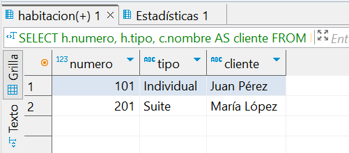

# Base de Datos de Hotel
## Codigo de DBeaver de creacion de base de datos y tablas

### Solucion Profe:

-- Creación de la base de datos
drop database if exists hotel_management;
CREATE DATABASE hotel_management;
USE hotel_management;

-- Creación de tablas
CREATE TABLE IF NOT EXISTS Hotel (
    id INT AUTO_INCREMENT PRIMARY KEY,
    nombre VARCHAR(100) NOT NULL,
    direccion VARCHAR(255) NOT NULL
);

CREATE TABLE IF NOT EXISTS Habitacion (
    id INT AUTO_INCREMENT PRIMARY KEY,
    numero INT NOT NULL,
    tipo VARCHAR(50),
    hotel_id INT,
    estado VARCHAR(50) DEFAULT 'Disponible',
    FOREIGN KEY (hotel_id) REFERENCES Hotel(id)
);

CREATE TABLE IF NOT EXISTS Cliente (
    id INT AUTO_INCREMENT PRIMARY KEY,
    nombre VARCHAR(100) NOT NULL,
    email VARCHAR(100) NOT NULL
);

CREATE TABLE IF NOT EXISTS Reserva (
    id INT AUTO_INCREMENT PRIMARY KEY,
    cliente_id INT,
    habitacion_id INT,
    fecha_inicio DATE NOT NULL,
    fecha_fin DATE NOT NULL,
    estado VARCHAR(50) DEFAULT 'Activa',
    FOREIGN KEY (cliente_id) REFERENCES Cliente(id),
    FOREIGN KEY (habitacion_id) REFERENCES Habitacion(id)
);

CREATE TABLE IF NOT EXISTS Servicio (
    id INT AUTO_INCREMENT PRIMARY KEY,
    nombre VARCHAR(100) NOT NULL,
    descripcion TEXT
);

CREATE TABLE IF NOT EXISTS Reserva_Servicio (
    reserva_id INT,
    servicio_id INT,
    PRIMARY KEY (reserva_id, servicio_id),
    FOREIGN KEY (reserva_id) REFERENCES Reserva(id),
    FOREIGN KEY (servicio_id) REFERENCES Servicio(id)
);

-- Inserción de datos de ejemplo
INSERT INTO Hotel (nombre, direccion) VALUES
    ('Hotel Ejemplo', 'Calle Principal, Ciudad'),
    ('Hotel de Lujo', 'Avenida Principal, Ciudad');

INSERT INTO Habitacion (numero, tipo, hotel_id) VALUES
    (101, 'Individual', 1),
    (102, 'Doble', 1),
    (201, 'Suite', 2),
    (202, 'Doble', 2);

INSERT INTO Cliente (nombre, email) VALUES
    ('Juan Pérez', 'juan@example.com'),
    ('María López', 'maria@example.com');

INSERT INTO Reserva (cliente_id, habitacion_id, fecha_inicio, fecha_fin) VALUES
    (1, 1, '2024-07-15', '2024-07-20'),
    (2, 3, '2024-08-01', '2024-08-05');

INSERT INTO Servicio (nombre, descripcion) VALUES
    ('Desayuno', 'Desayuno completo servido en la habitación'),
    ('Spa', 'Masajes y tratamientos de spa'),
    ('Excursión', 'Excursión guiada por la ciudad');

INSERT INTO Reserva_Servicio (reserva_id, servicio_id) VALUES
    (1, 1),
    (1, 2),
    (2, 3);

-- Alteración de tabla para añadir columna
ALTER TABLE Reserva
ADD COLUMN fecha_checkin DATE,
ADD COLUMN fecha_checkout DATE;

-- Consultas con Joins
-- 1. Obtener la lista de habitaciones reservadas junto con los nombres de los clientes que las ocupan.
SELECT Habitacion.numero, Cliente.nombre AS nombre_cliente, Reserva.fecha_inicio, Reserva.fecha_fin
FROM Habitacion
JOIN Reserva ON Habitacion.id = Reserva.habitacion_id
JOIN Cliente ON Reserva.cliente_id = Cliente.id;

-- 2. Obtener la lista de servicios reservados por un cliente específico junto con los detalles de cada servicio.
SELECT Cliente.nombre AS nombre_cliente, Servicio.nombre AS nombre_servicio, Servicio.descripcion
FROM Cliente
JOIN Reserva ON Cliente.id = Reserva.cliente_id
JOIN Reserva_Servicio ON Reserva.id = Reserva_Servicio.reserva_id
JOIN Servicio ON Reserva_Servicio.servicio_id = Servicio.id
WHERE Cliente.id = 1;

-- 3. Consulta anidada: Obtener la lista de habitaciones ocupadas en un hotel específico
SELECT *
FROM Habitacion
WHERE hotel_id = 1
AND estado = 'Ocupada'
AND id IN (
    SELECT habitacion_id
    FROM Reserva
    WHERE estado = 'Activa'
);

-- Trigger para actualizar el estado de la habitación al realizar una reserva o cancelación
DELIMITER //

CREATE TRIGGER actualizar_estado_habitacion AFTER INSERT ON Reserva
    FOR EACH ROW
    BEGIN
        UPDATE Habitacion SET estado = 'Ocupada' WHERE id = NEW.habitacion_id;
    END;//

DELIMITER ;

-- Ejemplo de consulta para verificar el estado de las habitaciones después de una reserva
SELECT * FROM Habitacion;

# Parte 1: Diseño de la Base de Datos
## Modelado de Entidades y Relaciones
### Entidades y Atributos

### Hotel
id_hotel (INT, PK)
nombre (VARCHAR(100))
direccion (VARCHAR(255))
telefono (VARCHAR(20))

### Habitación
id_habitacion (INT, PK)
numero (VARCHAR(10))
tipo (VARCHAR(50))
precio (DECIMAL(10, 2))
id_hotel (INT, FK) -> Referencia a Hotel

### Cliente
id_cliente (INT, PK)
nombre (VARCHAR(100))
telefono (VARCHAR(20))
email (VARCHAR(100))

### Reserva
id_reserva (INT, PK)
id_cliente (INT, FK) -> Referencia a Cliente
id_habitacion (INT, FK) -> Referencia a Habitación
fecha_check_in (DATE)
fecha_check_out (DATE)

### Servicio
id_servicio (INT, PK)
nombre (VARCHAR(100))
descripcion (TEXT)
precio (DECIMAL(10, 2))

### Cliente_Servicio (Tabla intermedia para relación Many-to-Many)
id_cliente (INT, FK) -> Referencia a Cliente
id_servicio (INT, FK) -> Referencia a Servicio

## Relaciones
Hotel - Habitación: One-to-Many (Un hotel tiene muchas habitaciones)
Cliente - Habitación: One-to-One a través de la tabla Reserva (Un cliente puede tener una reserva activa en una habitación específica)
Cliente - Servicio: Many-to-Many (Un cliente puede reservar muchos servicios y un servicio puede ser reservado por muchos clientes)

# Parte 2: Implementación de Relaciones

### Relaciones One-to-One, One-to-Many y Many-to-Many

### One-to-One: Cliente y Habitación
Para registrar la asignación de habitaciones a clientes específicos, la relación se maneja a través de la tabla Reserva.

### One-to-Many: Hotel y Habitación
Un hotel puede tener múltiples habitaciones, por lo que la tabla Habitación tiene una clave foránea id_hotel que se refiere a Hotel.

### Many-to-Many: Cliente y Servicio
La relación many-to-many se gestiona con una tabla intermedia Cliente_Servicio, que contiene las claves foráneas de las tablas Cliente y Servicio.

# Parte 3: Alteración de Tablas

## Modificación de la Tabla Reserva

Tabla original codigo de Jarko.

#### Codigo para añadir columna.

ALTER TABLE Reserva  
ADD COLUMN fecha_check_in DATE, 
ADD COLUMN fecha_check_out DATE; 

### Resultado de la tabla modificada:

Tabla modificada con ALTER.

# Parte 4: Consultas con Joins
## Consultas con Joins
### Obtener la lista de habitaciones reservadas junto con los nombres de los clientes que las ocupan:

USE hotel_management;

SELECT h.numero, h.tipo, c.nombre AS cliente 
FROM Habitacion h 
JOIN Reserva r ON h.id = r.habitacion_id 
JOIN Cliente c ON r.cliente_id = c.id; 

USE hotel_management;

SELECT Cliente.nombre AS nombre_cliente, Servicio.nombre AS nombre_servicio, Servicio.descripcion 
FROM Cliente 
JOIN Reserva ON Cliente.id = Reserva.cliente_id 
JOIN Reserva_Servicio ON Reserva.id = Reserva_Servicio.reserva_id 
JOIN Servicio ON Reserva_Servicio.servicio_id = Servicio.id 
WHERE Cliente.id = 2; 

