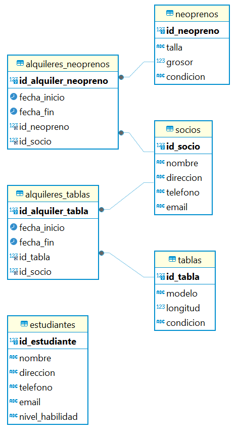
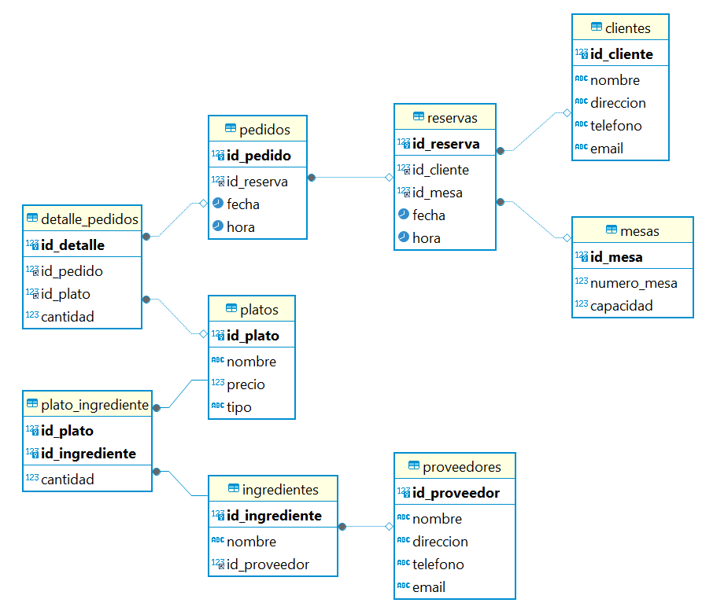
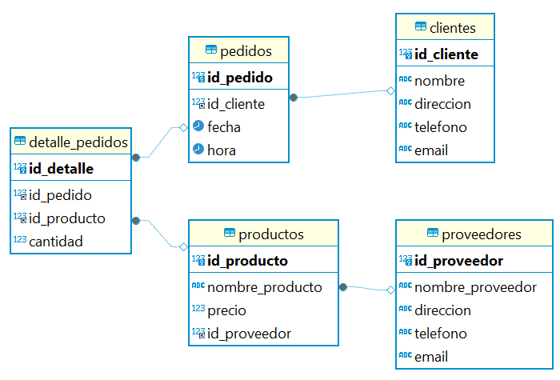

# 1. Grado y cardinalidad

### Basándote en los ejercicios de ayer, indica el grado y la cardinalidad de las tablas del Lab1.

Primero, vamos a revisar el grado y la cardinalidad de las tablas del Lab1 (el ejemplo de la biblioteca), luego crearemos un modelo conceptual para tres sistemas y, finalmente, trabajaremos en una base de datos de películas con sus respectivas funciones.

## Parte 1: Grado y Cardinalidad de las Tablas del Lab1

### Definición

Grado: Número de atributos (columnas) en una tabla.
Cardinalidad: Número de registros (filas) en una tabla.
Tablas del Lab1 (Biblioteca)

### Tabla Libros

Grado: 4 (id_libro, titulo, anio_publicacion, genero)
Cardinalidad: Número de libros en la tabla, por ejemplo, si hay 5 libros, la cardinalidad es 5.

### Tabla Autores

Grado: 2 (id_autor, nombre)
Cardinalidad: Número de autores en la tabla.

### Tabla Ejemplares

Grado: 4 (id_ejemplar, id_libro, ubicacion, estado)
Cardinalidad: Número de ejemplares en la tabla.

### Tabla Editoriales

Grado: 2 (id_editorial, nombre)
Cardinalidad: Número de editoriales en la tabla.

### Tabla LibroAutor

Grado: 2 (id_libro, id_autor)
Cardinalidad: Número de relaciones entre libros y autores.

# 2. Crear un Modelo Conceptual de Base de Datos

## Objetivo

El objetivo de este ejercicio es diseñar un modelo conceptual de base de datos utilizando el modelo entidad-relación (ERD). Esto implica identificar las entidades, atributos y relaciones necesarias para representar la información de un sistema específico.

Quiero que desarroller 3 sistemas completos para sistemas reales. 

Por ejemplo:
 
 - una biblioteca (que es el ejemplo que te voy a poner a continuación).
 - un supermercado.  
 - una tienda de electrodomésticos.

Elige 3 temas que te motiven, porque podrás reutilizar este trabajo más adelante.

## Descripción del Problema

Puedes crear la base de datos sobre lo que quieras, en el ejemplo lo haremos sobre una biblioteca. La biblioteca necesita gestionar información sobre libros, autores, géneros literarios, miembros y préstamos de libros. Los requisitos del sistema son los siguientes:

Libros: La biblioteca tiene una colección de libros, y cada libro tiene un título, ISBN, fecha de publicación y puede pertenecer a uno o más géneros.
Autores: Cada libro puede tener uno o más autores. Los autores tienen un nombre, una fecha de nacimiento y una nacionalidad.
Géneros: Los libros pertenecen a géneros literarios. Cada género tiene un nombre y una descripción.
Miembros: La biblioteca tiene miembros que pueden tomar prestados libros. Los miembros tienen un número de identificación, nombre, dirección, teléfono y correo electrónico.
Préstamos: Los miembros pueden tomar prestados libros. Cada préstamo tiene una fecha de inicio, una fecha de devolución y puede estar asociado a uno o más libros y un miembro.
Instrucciones
Identificar Entidades y Atributos:

Libros: título, ISBN, fecha de publicación.
Autores: nombre, fecha de nacimiento, nacionalidad.
Géneros: nombre, descripción.
Miembros: número de identificación, nombre, dirección, teléfono, correo electrónico.
Préstamos: fecha de inicio, fecha de devolución.
Identificar Relaciones:

Un libro puede tener uno o más autores.
Un autor puede haber escrito uno o más libros.
Un libro puede pertenecer a uno o más géneros.
Un género puede tener uno o más libros.
Un miembro puede tomar prestado uno o más libros.
Un libro puede ser tomado prestado por uno o más miembros (en diferentes ocasiones).
Un préstamo está asociado a un miembro y uno o más libros.
Dibujar el Diagrama ER:

Usa un software de diagramación o dibuja a mano el diagrama ER que represente las entidades, atributos y relaciones identificadas.
Describir las Cardinalidades:

Define las cardinalidades de cada relación (por ejemplo, uno a muchos, muchos a muchos).
Ejemplo de Modelo Conceptual
A continuación, se muestra un ejemplo simplificado del modelo conceptual en formato texto.

Entidades y Atributos
Libro

Título
ISBN
Fecha de Publicación
Autor

Nombre
Fecha de Nacimiento
Nacionalidad
Género

Nombre
Descripción
Miembro

Número de Identificación
Nombre
Dirección
Teléfono
Correo Electrónico
Préstamo

Fecha de Inicio
Fecha de Devolución

### Relaciones

Libro-Autor: Un libro puede tener uno o más autores, y un autor puede haber escrito uno o más libros.
Libro-Género: Un libro puede pertenecer a uno o más géneros, y un género puede tener uno o más libros.
Miembro-Préstamo: Un miembro puede tener uno o más préstamos, y un préstamo está asociado a un miembro.
Préstamo-Libro: Un préstamo puede incluir uno o más libros, y un libro puede ser incluido en diferentes préstamos a lo largo del tiempo.
Entrega
Entrega tu modelo conceptual en un archivo PDF o una imagen clara del diagrama ER extraído del Dbeaver, junto con una breve descripción de las entidades, atributos y relaciones como se muestra en el ejemplo anterior.

# Mis bases de datos:

## Escuela de surf

La escuela de surf WAVEADDICT necesita gestionar información sobre:

- Tablas de surf y sus alquileres.
- Neoprenos y sus alquileres.
- Datos de Socios (personas que pagan una cuota mensual para tener acceso a descuentos y otros beneficios).
- Estudiantes (personas que toman clases de surf).

### Los requisitos del sistema son los siguientes:

### Tablas de Surf

- Cada tabla de surf tiene un identificador único, un modelo, una longitud y una condición (nueva, usada).

### Neoprenos

- Cada neopreno tiene un identificador único, una talla, un grosor y una condición (Corto, Largo).

### Alquileres de Tablas

- Cada alquiler de tabla tiene un identificador único, una fecha de inicio, una fecha de fin y está asociado a una tabla y un socio.

### Alquileres de Neoprenos

- Cada alquiler de neopreno tiene un identificador único, una fecha de inicio, una fecha de fin y está asociado a un neopreno y un socio.

## Socios

- Cada socio tiene un identificador único, un nombre, una dirección, un teléfono y un correo electrónico.

### Estudiantes

- Cada estudiante tiene un identificador único, un nombre, una dirección, un teléfono, un correo electrónico y un nivel de habilidad (principiante, intermedio, avanzado).

## Instrucciones

### 1. Identificar Entidades y Atributos

### Tablas de Surf
id_tabla
modelo
longitud
condicion

### Neoprenos
id_neopreno
talla
grosor
condicion

### Alquileres de Tablas
id_alquiler_tabla
fecha_inicio
fecha_fin
id_tabla
id_socio

### Alquileres de Neoprenos
id_alquiler_neopreno
fecha_inicio
fecha_fin
id_neopreno
id_socio

### Socios
id_socio
nombre
direccion
telefono
email

### Estudiantes
id_estudiante
nombre
direccion
telefono
email
nivel_habilidad

### 2. Identificar Relaciones

- Un socio puede alquilar una o más tablas.
- Una tabla puede ser alquilada por diferentes socios en distintos momentos.
- Un socio puede alquilar uno o más neoprenos.
- Un neopreno puede ser alquilado por diferentes socios en distintos momentos.
- Un socio puede ser también un estudiante.
- Un estudiante puede tomar clases (una relación más detallada si se desean agregar clases y horarios).

### 3. Dibujar el Diagrama ER

Usando una herramienta de diagramación (como DBeaver, Draw.io o similar), crea el diagrama ER con las entidades, atributos y relaciones identificadas.

### 4. Describir las Cardinalidades

### Alquileres de Tablas
Un socio puede tener muchos alquileres de tablas (1 a N).
Una tabla puede estar en muchos alquileres (1 a N).

### Alquileres de Neoprenos
Un socio puede tener muchos alquileres de neoprenos (1 a N).
Un neopreno puede estar en muchos alquileres (1 a N).

### Socios y Estudiantes
Un socio puede ser también un estudiante, y viceversa (1 a 1 si son la misma persona).

## Modelo Conceptual en Formato Texto

## Entidades y Atributos

### Tablas de Surf
id_tabla (Primary Key)
modelo
longitud
condicion

### Neoprenos
id_neopreno (Primary Key)
talla
grosor
condicion

### Alquileres de Tablas
id_alquiler_tabla (Primary Key)
fecha_inicio
fecha_fin
id_tabla (Foreign Key)
id_socio (Foreign Key)

### Alquileres de Neoprenos
id_alquiler_neopreno (Primary Key)
fecha_inicio
fecha_fin
id_neopreno (Foreign Key)
id_socio (Foreign Key)

### Socios
id_socio (Primary Key)
nombre
direccion
telefono
email

### Estudiantes
id_estudiante (Primary Key)
nombre
direccion
telefono
email
nivel_habilidad
Relaciones

### Alquileres de Tablas
Un socio puede tener muchos alquileres de tablas, y una tabla puede estar en muchos alquileres.
Cardinalidad: (1 socio a N alquileres), (1 tabla a N alquileres).

### Alquileres de Neoprenos
Un socio puede tener muchos alquileres de neoprenos, y un neopreno puede estar en muchos alquileres.
Cardinalidad: (1 socio a N alquileres), (1 neopreno a N alquileres).

## Implementación en SQL

A continuación se muestra cómo implementar esto en SQL:

-- Crear la base de datos
DROP DATABASE IF EXISTS escuela_surf_db;
CREATE DATABASE escuela_surf_db;
USE escuela_surf_db;

-- Crear la tabla Socios
CREATE TABLE Socios (
    id_socio INT AUTO_INCREMENT PRIMARY KEY,
    nombre VARCHAR(255) NOT NULL,
    direccion VARCHAR(255) NOT NULL,
    telefono VARCHAR(20) NOT NULL,
    email VARCHAR(255) NOT NULL
);

-- Crear la tabla Estudiantes
CREATE TABLE Estudiantes (
    id_estudiante INT AUTO_INCREMENT PRIMARY KEY,
    nombre VARCHAR(255) NOT NULL,
    direccion VARCHAR(255) NOT NULL,
    telefono VARCHAR(20) NOT NULL,
    email VARCHAR(255) NOT NULL,
    nivel_habilidad VARCHAR(50) NOT NULL
);

-- Crear la tabla Tablas de Surf
CREATE TABLE Tablas (
    id_tabla INT AUTO_INCREMENT PRIMARY KEY,
    modelo VARCHAR(255) NOT NULL,
    longitud DECIMAL(5, 2) NOT NULL,
    condicion VARCHAR(50) NOT NULL
);

-- Crear la tabla Neoprenos
CREATE TABLE Neoprenos (
    id_neopreno INT AUTO_INCREMENT PRIMARY KEY,
    talla VARCHAR(10) NOT NULL,
    grosor DECIMAL(3, 2) NOT NULL,
    condicion VARCHAR(50) NOT NULL
);

-- Crear la tabla Alquileres de Tablas
CREATE TABLE Alquileres_Tablas (
    id_alquiler_tabla INT AUTO_INCREMENT PRIMARY KEY,
    fecha_inicio DATE NOT NULL,
    fecha_fin DATE NOT NULL,
    id_tabla INT NOT NULL,
    id_socio INT NOT NULL,
    FOREIGN KEY (id_tabla) REFERENCES Tablas(id_tabla),
    FOREIGN KEY (id_socio) REFERENCES Socios(id_socio)
);

-- Crear la tabla Alquileres de Neoprenos
CREATE TABLE Alquileres_Neoprenos (
    id_alquiler_neopreno INT AUTO_INCREMENT PRIMARY KEY,
    fecha_inicio DATE NOT NULL,
    fecha_fin DATE NOT NULL,
    id_neopreno INT NOT NULL,
    id_socio INT NOT NULL,
    FOREIGN KEY (id_neopreno) REFERENCES Neoprenos(id_neopreno),
    FOREIGN KEY (id_socio) REFERENCES Socios(id_socio)
);

-- Insertar datos en la tabla Socios
INSERT INTO Socios (nombre, direccion, telefono, email) VALUES
('John Doe', '123 Surf Street', '555-1234', 'john.doe@example.com'),
('Jane Smith', '456 Wave Avenue', '555-5678', 'jane.smith@example.com'),
('Mike Johnson', '789 Ocean Drive', '555-9012', 'mike.johnson@example.com');

-- Insertar datos en la tabla Estudiantes
INSERT INTO Estudiantes (nombre, direccion, telefono, email, nivel_habilidad) VALUES
('John Doe', '123 Surf Street', '555-1234', 'john.doe@example.com', 'Intermedio'),
('Alice Brown', '101 Beach Blvd', '555-3456', 'alice.brown@example.com', 'Principiante'),
('Charlie Black', '202 Sea Lane', '555-7890', 'charlie.black@example.com', 'Avanzado');

-- Insertar datos en la tabla Tablas de Surf
INSERT INTO Tablas (modelo, longitud, condicion) VALUES
('Shortboard', 5.9, 'Nueva'),
('Longboard', 9.0, 'Usada'),
('Fish', 6.3, 'Nueva');

-- Insertar datos en la tabla Neoprenos
INSERT INTO Neoprenos (talla, grosor, condicion) VALUES
('M', 3.2, 'Nuevo'),
('L', 4.3, 'Usado'),
('S', 2.5, 'Nuevo');

-- Insertar datos en la tabla Alquileres de Tablas
INSERT INTO Alquileres_Tablas (fecha_inicio, fecha_fin, id_tabla, id_socio) VALUES
('2024-07-01', '2024-07-07', 1, 1),
('2024-07-08', '2024-07-14', 2, 2),
('2024-07-15', '2024-07-21', 3, 3);

## Restaurante

### Paso 1: Identificar Entidades y Atributos

### Entidades y Atributos para un Restaurante:

### Clientes
id_cliente (INT, PK)
nombre (VARCHAR)
direccion (VARCHAR)
telefono (VARCHAR)
email (VARCHAR)

### Mesas
id_mesa (INT, PK)
numero_mesa (INT)
capacidad (INT)

### Reservas
id_reserva (INT, PK)
id_cliente (INT, FK)
id_mesa (INT, FK)
fecha (DATE)
hora (TIME)

### Platos
id_plato (INT, PK)
nombre (VARCHAR)
precio (DECIMAL)
tipo (VARCHAR) // Ej: entrada, principal, postre

### Pedidos
id_pedido (INT, PK)
id_reserva (INT, FK)
fecha (DATE)
hora (TIME)
Detalle_Pedidos
id_detalle (INT, PK)
id_pedido (INT, FK)
id_plato (INT, FK)
cantidad (INT)

### Proveedores
id_proveedor (INT, PK)
nombre (VARCHAR)
direccion (VARCHAR)
telefono (VARCHAR)
email (VARCHAR)

### Ingredientes
id_ingrediente (INT, PK)
nombre (VARCHAR)
id_proveedor (INT, FK)

### Plato_Ingrediente (Tabla intermedia para relación Many-to-Many)
id_plato (INT, FK)
id_ingrediente (INT, FK)
cantidad (DECIMAL)

## Paso 2: Identificar Relaciones

- Un cliente puede hacer una o más reservas.
- Una reserva está asociada a un cliente y a una mesa.
- Una mesa puede tener muchas reservas (en diferentes momentos).
- Un pedido está asociado a una reserva.
- Un pedido puede tener uno o más platos (detalle del pedido).
- Un plato puede estar en uno o más pedidos.
- Un plato puede tener uno o más ingredientes.
- Un ingrediente puede ser utilizado en uno o más platos.
- Un proveedor puede suministrar uno o más ingredientes.

## Paso 3: Dibujar el Diagrama ER

Vamos a representar gráficamente estas entidades y relaciones en un Diagrama ER.

## Paso 4: Describir las Cardinalidades

Cliente - Reserva: Un cliente puede tener muchas reservas (1).

Reserva - Mesa: Una reserva se asocia a una mesa (N:1).

Reserva - Pedido: Una reserva puede tener muchos pedidos (1).

Pedido - Detalle_Pedidos: Un pedido puede tener muchos detalles de pedido (1).

Plato - Detalle_Pedidos: Un plato puede estar en muchos detalles de pedido (1).

Plato - Plato_Ingrediente: Un plato puede tener muchos ingredientes (1).

Ingrediente - Plato_Ingrediente: Un ingrediente puede estar en muchos platos (1).

Proveedor - Ingrediente: Un proveedor puede suministrar muchos ingredientes (1).

## Paso 5: Crear las Tablas en SQL

Vamos a escribir el código SQL para crear las tablas:

drop database if exists restaurante_db;
create database restaurante_db;
use restaurante_db;

create table Clientes (
	id_cliente INT auto_increment primary key,
	nombre VARCHAR (255) not null,
	direccion YEAR,
	telefono VARCHAR(20) not null,
	email VARCHAR(100) not NULL	
);

create table Mesas (
	id_mesa INT auto_increment primary key,
	numero_mesa INT not null,
	capacidad INT not NULL
);

create table Reservas (
	id_reserva INT auto_increment primary key,
	id_cliente INT,
	id_mesa INT,
	fecha DATE not null,
	hora TIME not null,
	foreign key (id_cliente) references Clientes(id_cliente),
	foreign key Mesas(id_mesa) references Mesas(id_mesa)
);

create table Platos (
	id_plato INT auto_increment primary key,
	nombre VARCHAR(255) not null,
	precio DECIMAL(10, 2) not null,
	tipo VARCHAR(50) not NULL
);

create table Pedidos (
	id_pedido INT auto_increment primary key,
	id_reserva INT,
	fecha DATE not null,
	hora TIME not null,
	foreign key (id_reserva) references Reservas(id_reserva)
);

create table Detalle_pedidos (
	id_detalle INT auto_increment primary key,
	id_pedido INT,
	id_plato INT,
	cantidad INT not null,
	foreign key (id_pedido) references Pedidos(id_pedido),
	foreign key (id_plato) references Platos(id_plato)	
);

create table Proveedores (
	id_proveedor INT auto_increment primary key,
	nombre VARCHAR(255) not null,
	direccion VARCHAR(255),
	telefono VARCHAR(20),
	email VARCHAR(255)
);

create table Ingredientes (
	id_ingrediente INT auto_increment primary key,
	nombre VARCHAR(255) not NULL,
	id_proveedor INT,
	foreign key (id_proveedor) references Proveedores(id_proveedor)	
);

create table Plato_ingrediente (
	id_plato INT,
	id_ingrediente INT,
	cantidad DECIMAL(10, 2) not null,
	primary key (id_plato, id_ingrediente),
	foreign key (id_plato) references PLATOS(id_plato),
	foreign key (id_ingrediente) references Ingredientes(id_ingrediente)
);

## Paso 6: Insertar Datos de Ejemplo

Vamos a insertar algunos datos de ejemplo para llenar la base de datos:

use restaurante_db;
insert into Clientes (nombre, direccion, telefono, email) values
('Fran Perea', 'Calle 1', '635998811', 'juanchoperez@xample.com'),
('Guille Serrano', 'Santa Justa 123', '635774411', 'guille@example.com'),
('Curro Serrano', 'Centro de Madrid 57', '635993322', 'curro@example.com'),
('Jaime Molina', 'Calle del olvido 127', '635223355', 'jaimemolina@example.com'),
('Carlos Merchan', 'Calle verdadera 123', '635221144', 'Carlos@example.com');

insert into Mesas (numero_mesa, capacidad) values
(1, 4),
(2, 2),
(3, 6),
(4, 4),
(5, 3);

insert into Reservas (id_cliente, id_mesa, fecha, hora) values
(1, 5, '2024-07-18', '19:00:00'),
(2, 4, '2024-07-18', '19:30:00'),
(3, 3, '2024-07-18', '19:30:00'),
(4, 2, '2024-07-18', '19:30:00'),
(5, 1, '2024-07-18', '20:00:00');

insert into Platos (nombre, precio, tipo) values
('ensalada', 5.99, 'entrada'),
('Solomillo', 7.99, 'principal'),
('Pasta', 7.50, 'Principal'),
('Helado', 4.50, 'postre'),
('cake de manzana', 6.00, 'postre');

insert into Detalle_pedidos (id_pedido, id_plato, cantidad) values
(1, 1, 2),
(2, 2, 3),
(3, 2, 4);

INSERT INTO Proveedores (nombre, direccion, telefono, email) VALUES
('Proveedor A', 'Calle Proveedor 1', '111-222-3333', 'proveedora@example.com'),
('Proveedor B', 'Calle Proveedor 2', '444-555-6666', 'proveedorb@example.com');

INSERT INTO Ingredientes (nombre, id_proveedor) VALUES
('Tomate', 1),
('Lechuga', 1),
('Carne', 2),
('Pasta', 2);

INSERT INTO Plato_Ingrediente (id_plato, id_ingrediente, cantidad) VALUES
(1, 1, 0.5),
(1, 2, 0.3),
(3, 3, 0.8),
(4, 4, 0.6);

## Supermercado

### Paso 1: Identificar Entidades y Atributos para supermercado:

### Clientes
id_cliente: Identificador único para cada cliente.
nombre: Nombre del cliente.
direccion: Dirección del cliente.
telefono: Teléfono de contacto del cliente.
email: Correo electrónico del cliente.

### Productos
id_producto: Identificador único para cada producto.
nombre_producto: Nombre del producto.
precio: Precio del producto.
id_proveedor: Identificador del proveedor del producto (Clave foránea).

### Proveedores
id_proveedor: Identificador único para cada proveedor.
nombre_proveedor: Nombre del proveedor.
direccion: Dirección del proveedor.
telefono: Teléfono de contacto del proveedor.
email: Correo electrónico del proveedor.

### Pedidos
id_pedido: Identificador único para cada pedido.
id_cliente: Identificador del cliente que realizó el pedido (Clave foránea).
fecha: Fecha del pedido.
hora: Hora del pedido.

### Detalle_Pedidos
id_detalle: Identificador único para cada detalle de pedido.
id_pedido: Identificador del pedido (Clave foránea).
id_producto: Identificador del producto (Clave foránea).
cantidad: Cantidad del producto en el pedido.

## Paso 2: Identificar Relaciones

- Cliente - Pedido: Un cliente puede hacer uno o más pedidos, y un pedido está asociado a un cliente.
- Proveedor - Producto: Un proveedor puede suministrar uno o más productos, y un producto es suministrado por un proveedor.
- Pedido - Detalle_Pedidos: Un pedido puede tener uno o más detalles de pedidos, y un detalle de pedido está asociado a un pedido.
- Producto - Detalle_Pedidos: Un producto puede aparecer en uno o más detalles de pedidos, y un detalle de pedido incluye un producto.

## Paso 3: Dibujar el Diagrama ER

Vamos a representar gráficamente estas entidades y relaciones en un Diagrama ER.

## Paso 4: Describir las Cardinalidades

- Cliente - Pedido: 1 a N (Un cliente puede hacer muchos pedidos, pero un pedido está asociado a un cliente).
- Proveedor - Producto: 1 a N (Un proveedor puede suministrar muchos productos, pero un producto tiene un proveedor).
- Pedido - Detalle_Pedidos: 1 a N (Un pedido puede tener muchos detalles de pedidos, pero un detalle de pedido pertenece a un pedido).
- Producto - Detalle_Pedidos: 1 a N (Un producto puede estar en muchos detalles de pedidos, pero un detalle de pedido incluye un producto).

## Paso 5: Crear las Tablas en SQL

Vamos a escribir el código SQL para crear las tablas:

drop database if exists supermercado_db;
create database supermercado_db;
use supermercado_db;

create table Clientes (
	id_cliente INT auto_increment primary key,
	nombre VARCHAR(255) not null,
	direccion VARCHAR(255),
	telefono VARCHAR(20),
	email VARCHAR(255)	
);

create table Proveedores (
	id_proveedor INT auto_increment primary key,
	nombre_proveedor VARCHAR(255) NOT NULL,
	direccion VARCHAR(255),
	telefono VARCHAR(20),
	email VARCHAR(255)
);

create table Productos (
	id_producto INT auto_increment primary key,
	nombre_producto VARCHAR(255)  not null,
	precio DECIMAL(10, 2) not null,
	id_proveedor INT,
	foreign key (id_proveedor) references Proveedores(id_proveedor)
);

create TABLE Pedidos (
	id_pedido INT auto_increment primary key,
	id_cliente INT,
	fecha DATE not null,
	hora TIME not null,
	foreign key (id_cliente) references Clientes(id_cliente)
);

create TABLE Detalle_pedidos (
	id_detalle INT auto_increment primary key,
	id_pedido INT,
	id_producto INT,
	cantidad INT not null,
	foreign key (id_pedido) references Pedidos(id_pedido),
	foreign key (id_producto) references Productos(id_producto)
);

## Paso 6: Insertar Datos de Ejemplo dentro de cada tabla.

use supermercado_db;

INSERT INTO Clientes (nombre, direccion, telefono, email) VALUES
('Juan Perez', 'Calle 1', '123456789', 'juan.perez@example.com'),
('Maria Gomez', 'Calle 2', '987654321', 'maria.gomez@example.com'),
('Pedro Martinez', 'Calle 3', '555666777', 'pedro.martinez@example.com'),
('Laura Fernandez', 'Calle 4', '888999000', 'laura.fernandez@example.com'),
('Ana Lopez', 'Calle 5', '111222333', 'ana.lopez@example.com'),
('Carlos Sanchez', 'Calle 6', '444555666', 'carlos.sanchez@example.com'),
('Lucia Ramirez', 'Calle 7', '777888999', 'lucia.ramirez@example.com'),
('Miguel Torres', 'Calle 8', '000111222', 'miguel.torres@example.com'),
('Sandra Jimenez', 'Calle 9', '333444555', 'sandra.jimenez@example.com'),
('Javier Morales', 'Calle 10', '666777888', 'javier.morales@example.com');

INSERT INTO Proveedores (nombre_proveedor, direccion, telefono, email) VALUES
('Proveedor A', 'Calle Proveedor 1', '111-222-3333', 'proveedora@example.com'),
('Proveedor B', 'Calle Proveedor 2', '444-555-6666', 'proveedorb@example.com'),
('Proveedor C', 'Calle Proveedor 3', '777-888-9999', 'proveedorc@example.com'),
('Proveedor D', 'Calle Proveedor 4', '000-111-2222', 'proveedord@example.com'),
('Proveedor E', 'Calle Proveedor 5', '333-444-5555', 'proveedore@example.com'),
('Proveedor F', 'Calle Proveedor 6', '666-777-8888', 'proveedorf@example.com'),
('Proveedor G', 'Calle Proveedor 7', '999-000-1111', 'proveedorg@example.com'),
('Proveedor H', 'Calle Proveedor 8', '222-333-4444', 'proveedorh@example.com'),
('Proveedor I', 'Calle Proveedor 9', '555-666-7777', 'proveedori@example.com'),
('Proveedor J', 'Calle Proveedor 10', '888-999-0000', 'proveedorj@example.com');

INSERT INTO Productos (nombre_producto, precio, id_proveedor) VALUES
('Manzana', 1.50, 1),
('Leche', 0.99, 1),
('Pan', 1.20, 2),
('Queso', 2.50, 2),
('Tomate', 1.00, 3),
('Café', 4.50, 3),
('Azúcar', 0.80, 4),
('Sal', 0.70, 4),
('Arroz', 1.80, 5),
('Pasta', 1.50, 5);

INSERT INTO Pedidos (id_cliente, fecha, hora) VALUES
(1, '2024-07-15', '10:00:00'),
(2, '2024-07-16', '12:30:00'),
(3, '2024-07-17', '14:45:00'),
(4, '2024-07-18', '09:15:00'),
(5, '2024-07-19', '16:00:00'),
(6, '2024-07-20', '11:30:00'),
(7, '2024-07-21', '13:00:00'),
(8, '2024-07-22', '15:45:00'),
(9, '2024-07-23', '10:30:00'),
(10, '2024-07-24', '12:00:00');

INSERT INTO Detalle_Pedidos (id_pedido, id_producto, cantidad) VALUES
(1, 1, 5),
(1, 2, 2),
(2, 3, 3),
(2, 4, 1),
(3, 5, 4),
(3, 6, 2),
(4, 7, 1),
(4, 8, 5),
(5, 9, 3),
(5, 10, 2);

